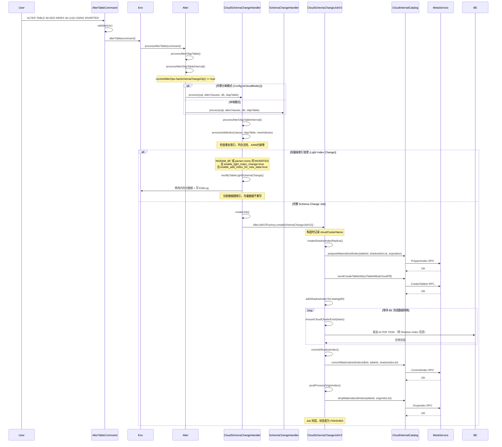

# FE 创建索引处理流程（存算分离架构）

本文以 `CREATE INDEX` 为例，梳理在存算分离（Cloud/存算分离）架构下，FE 侧的完整处理流程。

---

## 目录

- [整体架构说明](#整体架构说明)
- [关键类说明](#关键类说明)
- [CREATE INDEX 完整流程](#create-index-完整流程)
  - [1. SQL 解析与分析层](#1-sql-解析与分析层)
  - [2. Nereids 命令执行层](#2-nereids-命令执行层)
  - [3. DDL 路由层 (Alter.java)](#3-ddl-路由层-alterjava)
  - [4. Schema Change 处理层](#4-schema-change-处理层)
  - [5. 两条执行路径](#5-两条执行路径)
    - [5a. 轻量级索引变更（Light Index Change）](#5a-轻量级索引变更light-index-change)
    - [5b. 完整 Schema Change Job](#5b-完整-schema-change-job)
  - [6. 云端 Job 执行层](#6-云端-job-执行层)
- [存算分离与本地模式的核心差异](#存算分离与本地模式的核心差异)
- [完整序列图](#完整序列图)

---

## 整体架构说明

在存算分离架构中，数据存储在对象存储（如 S3/OSS）上，计算节点（BE）无状态。FE 不再直接管理 BE 上的副本，而是通过 **MetaService**（元数据服务）来管理 tablet 的元数据。因此，在存算分离模式下创建索引时，FE 的主要职责是：

1. **解析并验证** DDL 语句
2. **创建 Shadow Index** 的元数据（通过 RPC 调用 MetaService）
3. **协调 BE** 执行实际的数据重写任务
4. **提交或回滚** Shadow Index 到 MetaService

---

## 关键类说明

| 类名 | 所在包 | 职责 |
|------|--------|------|
| `AlterTableCommand` | `nereids.trees.plans.commands` | Nereids 命令层入口，调用 `ctx.getEnv().alterTable(this)` |
| `Env` | `catalog` | 调用 `alter.processAlterTable(command)` 进行转发 |
| `Alter` | `alter` | DDL 路由层，根据 `Config.isCloudMode()` 选择 `CloudSchemaChangeHandler` 或 `SchemaChangeHandler` |
| `SchemaChangeHandler` | `alter` | 本地模式 Schema Change 处理器，包含核心的 `processAddIndex()`、`modifyTableLightSchemaChange()`、`buildOrDeleteTableInvertedIndices()` 等方法 |
| `CloudSchemaChangeHandler` | `cloud.alter` | 存算分离模式的 Schema Change 处理器，继承自 `SchemaChangeHandler`，重写了涉及云端操作的方法 |
| `SchemaChangeJobV2` | `alter` | 本地模式的 Schema Change Job，负责管理 Shadow Index 的生命周期 |
| `CloudSchemaChangeJobV2` | `alter` | 存算分离模式的 Schema Change Job，重写了与 MetaService 交互的关键方法 |
| `IndexChangeJob` | `alter` | `BUILD INDEX` 操作的异步 Job，用于在已有数据上构建索引 |
| `CloudInternalCatalog` | `cloud.datasource` | 封装了与 MetaService 的 RPC 交互，包括 `prepareMaterializedIndex`、`commitMaterializedIndex`、`dropMaterializedIndex` 等 |
| `MetaServiceProxy` | `cloud.rpc` | MetaService RPC 代理 |
| `Index` | `catalog` | 索引元数据，包含 `isLightAddIndexSupported()` 方法判断是否支持轻量级索引变更 |
| `CreateIndexClause` | `analysis` | 解析 `CREATE INDEX` 或 `ALTER TABLE ... ADD INDEX` SQL 语句 |
| `IndexDef` | `analysis` | 索引定义，支持 INVERTED、BITMAP、BLOOMFILTER、NGRAM_BF、ANN 等类型 |
| `AlterJobV2Factory` | `alter` | 工厂类，根据 `Config.isCloudMode()` 创建 `CloudSchemaChangeJobV2` 或 `SchemaChangeJobV2` |

---

## CREATE INDEX 完整流程

### 1. SQL 解析与分析层

用户执行如下 SQL：
```sql
ALTER TABLE db.tbl ADD INDEX idx_name (col) USING INVERTED;
-- 或
CREATE INDEX idx_name ON db.tbl (col) USING INVERTED;
```

Nereids 解析器将其转换为：
- `CreateIndexClause`：携带 `IndexDef`（索引名、索引类型、列名、属性等）
- `IndexDef.analyze()` 完成语义检查（类型支持、列类型合法性等）

### 2. Nereids 命令执行层

```
AlterTableCommand.run(ctx, executor)
  → ctx.getEnv().alterTable(this)          // Env.java:5360
    → alter.processAlterTable(command)      // Alter.java:641
```

**关键代码**（`AlterTableCommand.java`）：
```java
public void run(ConnectContext ctx, StmtExecutor executor) throws Exception {
    validate(ctx);
    ctx.getEnv().alterTable(this);
}
```

### 3. DDL 路由层 (Alter.java)

`Alter` 类在初始化时根据运行模式选择不同的 `SchemaChangeHandler`：

```java
// Alter.java:132
schemaChangeHandler = Config.isCloudMode()
    ? new CloudSchemaChangeHandler()   // 存算分离模式
    : new SchemaChangeHandler();       // 本地模式
```

`processAlterTable()` → `processAlterOlapTable()` → `processAlterOlapTableInternal()`，
当 `currentAlterOps.hasSchemaChangeOp()` 为 `true` 时，调用：

```java
// Alter.java:278
schemaChangeHandler.process(sql, alterClauses, db, olapTable);
```

### 4. Schema Change 处理层

`SchemaChangeHandler.process()` → `processAlterOlapTableInternal()` 中，
当遇到 `CreateIndexClause` 时（`SchemaChangeHandler.java:2119`）：

```java
} else if (alterClause instanceof CreateIndexClause) {
    CreateIndexClause createIndexClause = (CreateIndexClause) alterClause;
    Index index = createIndexClause.getIndex();
    // 1. 调用 processAddIndex 做合法性检查（重复索引、列存在性、ANN 索引约束等）
    if (processAddIndex(createIndexClause, olapTable, newIndexes)) {
        return; // 索引已存在，直接返回（IF NOT EXISTS 语义）
    }
    lightSchemaChange = false;

    // 2. 判断是否支持轻量级索引变更
    // 存算分离模式：NGRAM_BF 和 parser=none 的 INVERTED 索引支持轻量级变更
    // 本地模式：INVERTED、ANN、NGRAM_BF 均支持轻量级变更
    if (index.isLightAddIndexSupported(enableAddIndexForNewData)) {
        alterIndexes.add(index);
        isDropIndex = false;
        lightIndexChange = true;
    }
}
```

**`processAddIndex()` 的职责**（`SchemaChangeHandler.java:2754`）：
1. 检查是否存在重名索引（若设置 `IF NOT EXISTS` 则直接返回 true）
2. 检查索引 ID 冲突并重新分配
3. ANN 索引约束检查（仅支持 DUP_KEYS 表）
4. 验证索引列存在性和类型合法性
5. 将索引加入 `newIndexes` 列表

### 5. 两条执行路径

根据检查结果，有两条不同的执行路径（`SchemaChangeHandler.java:2208-2228`）：

```java
if (lightSchemaChange) {
    // 路径A: 纯列变更的轻量级 Schema Change（与索引无关，此处略）
    modifyTableLightSchemaChange(...);
} else if (Config.enable_light_index_change && lightIndexChange) {
    // 路径B: 轻量级索引变更（Light Index Change）
    modifyTableLightSchemaChange(rawSql, db, olapTable, indexSchemaMap,
                                 newIndexes, alterIndexes, isDropIndex,
                                 jobId, false, propertyMap);
} else if (buildIndexChange) {
    // 路径C: BUILD INDEX（延迟构建，针对存量数据）
    buildOrDeleteTableInvertedIndices(db, olapTable, indexSchemaMap,
            alterIndexes, indexOnPartitions, false);
} else {
    // 路径D: 完整 Schema Change Job
    createJob(rawSql, db.getId(), olapTable, indexSchemaMap, propertyMap, newIndexes);
}
```

#### 5a. 轻量级索引变更（Light Index Change）

**触发条件**：`Config.enable_light_index_change == true` 且 `Index.isLightAddIndexSupported()` 返回 `true`

**存算分离模式下支持轻量级变更的索引类型**：
- `NGRAM_BF` 索引（当 `enable_add_index_for_new_data` session 变量为 true 时）
- `INVERTED` 索引且 `parser=none`（当 `enable_add_index_for_new_data` session 变量为 true 时）

**执行过程** (`modifyTableLightSchemaChange`)：
1. 直接修改 FE 内存中的表元数据（添加索引定义）
2. 写入 EditLog 持久化到 BDBJE（本地）
3. 对于存算分离模式，还需通知 MetaService 更新 tablet schema
4. 新写入的数据会建立索引，存量数据不构建索引

#### 5b. 完整 Schema Change Job

**触发条件**：其他所有不满足轻量级变更条件的场景（如 BITMAP、BLOOMFILTER 索引，或 parser≠none 的 INVERTED 索引）

**执行过程** (`createJob`)：

```
SchemaChangeHandler.createJob()
  → AlterJobV2Factory.createSchemaChangeJobV2()
    → CloudSchemaChangeJobV2 (存算分离模式)
    → SchemaChangeJobV2 (本地模式)
```

### 6. 云端 Job 执行层

`CloudSchemaChangeJobV2` 继承自 `SchemaChangeJobV2`，重写了以下关键方法：

#### 6.1 构造函数：记录云集群名称

```java
// CloudSchemaChangeJobV2.java:60-77
public CloudSchemaChangeJobV2(...) {
    super(...);
    // 从 ConnectContext 获取当前计算组（云集群）名称
    String clusterName = context.getCloudCluster();
    setCloudClusterName(clusterName);
}
```

#### 6.2 createShadowIndexReplica()：在 MetaService 创建 Shadow Index

```java
// CloudSchemaChangeJobV2.java:168-208
@Override
protected void createShadowIndexReplica() throws AlterCancelException {
    // 1. 调用 MetaService 的 prepareMaterializedIndex 接口预创建 Shadow Index
    ((CloudInternalCatalog) Env.getCurrentInternalCatalog())
            .prepareMaterializedIndex(tableId, shadowIdxList, expiration);

    // 2. 为每个 Partition 中的 Shadow Tablet 生成 TabletMetaCloudPB
    //    并通过 sendCreateTabletsRpc 发送给 MetaService
    createShadowIndexReplicaForPartition(tbl);

    // 3. 将 Shadow Index 加入 Catalog 内存
    addShadowIndexToCatalog(tbl);
}
```

**`createShadowIndexReplicaForPartition()` 细节**：
- 为每个 partition 的每个 shadow tablet 构建 `TabletMetaCloudPB`（包含 schema、索引、存储格式等信息）
- 通过 `CloudInternalCatalog.sendCreateTabletsRpc()` 批量发送给 MetaService 持久化

#### 6.3 commitShadowIndex()：提交 Shadow Index 为正式索引

当 BE 侧数据转换任务完成后，FE 调用此方法将 Shadow Index 提交为正式可见的索引：

```java
// CloudSchemaChangeJobV2.java:82-94
@Override
protected void commitShadowIndex() throws AlterCancelException {
    List<Long> shadowIdxList = indexIdMap.keySet().stream().collect(Collectors.toList());
    // 通过 CloudInternalCatalog 调用 MetaService 的 commitMaterializedIndex 接口
    ((CloudInternalCatalog) Env.getCurrentInternalCatalog())
            .commitMaterializedIndex(dbId, tableId, shadowIdxList, null, false);
}
```

#### 6.4 onCancel()：取消时清理 Shadow Index

```java
// CloudSchemaChangeJobV2.java:97-135
@Override
protected void onCancel() {
    // 1. 调用 MetaService 删除 Shadow Index 的 tablet 元数据
    dropIndex(shadowIdxList);

    // 2. 通知 MetaService 移除 SchemaChangeJob 记录
    ((CloudInternalCatalog) Env.getCurrentInternalCatalog())
            .removeSchemaChangeJob(jobId, dbId, tableId, originIndexId,
                    shadowIndexId, partitionId, originTabletId, shadowTabletId);
}
```

#### 6.5 postProcessOriginIndex()：删除原始 Index 的云端数据

```java
// CloudSchemaChangeJobV2.java:138-146
@Override
protected void postProcessOriginIndex() {
    List<Long> originIdxList = indexIdMap.values().stream().collect(Collectors.toList());
    // 通知 MetaService 删除原始 Index，释放云存储空间
    dropIndex(originIdxList);
}
```

#### 6.6 ensureCloudClusterExist()：检查计算组是否存在

```java
// CloudSchemaChangeJobV2.java:271-286
@Override
protected void ensureCloudClusterExist(List<AgentTask> tasks) throws AlterCancelException {
    // 验证 Job 创建时绑定的云集群（计算组）当前是否仍然存在
    // 若集群已被删除，则取消所有 ALTER 任务并抛出 AlterCancelException
    if (((CloudSystemInfoService) Env.getCurrentSystemInfo())
            .getCloudClusterIdByName(cloudClusterName) == null) {
        // 取消所有 tasks，抛出异常
        throw new AlterCancelException("cloud cluster(" + cloudClusterName + ") has been removed");
    }
}
```

---

## 存算分离与本地模式的核心差异

| 对比项 | 本地模式 | 存算分离模式 |
|--------|----------|-------------|
| **Schema Change 处理器** | `SchemaChangeHandler` | `CloudSchemaChangeHandler` |
| **Schema Change Job** | `SchemaChangeJobV2` | `CloudSchemaChangeJobV2` |
| **Shadow Tablet 创建** | 直接在 BE 本地磁盘上创建 Replica | 通过 `prepareMaterializedIndex` + `sendCreateTabletsRpc` → MetaService |
| **Shadow Index 提交** | 直接修改 FE Catalog 内存，写 EditLog | 通过 `commitMaterializedIndex` → MetaService |
| **取消/回滚** | 向 BE 发送 ClearAlterTask | 通过 `removeSchemaChangeJob` + `dropMaterializedIndex` → MetaService |
| **原始 Index 清理** | 向 BE 发送 DropReplicaTask | 通过 `dropMaterializedIndex` → MetaService |
| **轻量级索引变更** | INVERTED、ANN、NGRAM_BF 均支持 | 仅 NGRAM_BF 和 parser=none 的 INVERTED 支持 |
| **计算组（集群）** | 无 | Job 绑定创建时的计算组，执行时验证计算组是否存在 |
| **稳定性检查** | 需要检查 tablet 是否处于稳定状态 | `checkTableStable()` 直接返回 `true`（由 MetaService 保证） |

---

## 完整序列图



> **取消路径**：若 Job 在任意阶段取消，`onCancel()` 会调用 `removeSchemaChangeJob()` 和 `dropMaterializedIndex()` 通知 MetaService 清理 Shadow Index 数据。
